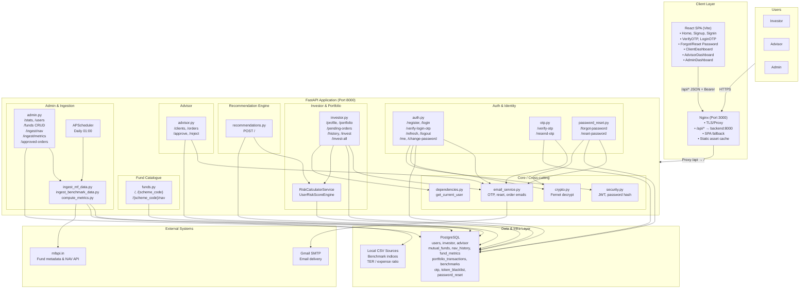

# Mutual Fund Purchase Optimizer (MFPO) — Low-Level Design Block Diagram

*Last updated from codebase analysis — March 2026*

---

## Architecture Overview

| Layer | Components | Technology |
|-------|------------|------------|
| **Client** | React SPA (Vite), Nginx | React 18, Vite, Tailwind, Recharts |
| **API Edge** | Nginx reverse proxy | Port 3000 → `/api/*` → backend:8000 |
| **Application** | FastAPI monolith | Python 3.x, FastAPI, SQLAlchemy |
| **Data** | PostgreSQL, local CSVs | Postgres, SQLAlchemy ORM |
| **External** | mfapi.in, Gmail SMTP | REST API, TLS SMTP |

---

## LLD Block Diagram (Mermaid)



---

## Request Flow Summary

| Flow | Path | Components |
|------|------|-------------|
| **Signup** | User → Nginx → POST /auth/register | auth.py → User+Investor/Advisor+OTP → email_service |
| **OTP Verify** | POST /auth/verify-otp | otp.py → OTP check → User.is_verified |
| **Login (2FA)** | POST /auth/login → OTP → POST /auth/verify-login-otp | auth.py → JWT tokens |
| **Recommendations** | POST /recommendations/ | recommendations.py → RiskCalc → FundMetrics → allocation |
| **Invest** | POST /investor/invest | investor.py → PortfolioTransaction PENDING → email advisor |
| **Order Approve** | POST /advisor/orders/{id}/approve | advisor.py → status APPROVED → email client |
| **NAV Refresh** | Scheduler 01:00 or POST /admin/ingest/nav | IngestScripts → mfapi.in → nav_history |

---

## Docker Deployment

```
┌─────────────────────────────────────────────────────────────┐
│  docker-compose                                              │
│  ┌─────────────────┐    ┌─────────────────┐                 │
│  │ frontend:3001   │    │ backend:8000    │                 │
│  │ (Nginx + React) │───▶│ (FastAPI)       │                 │
│  │ /api/* → 8000   │    │ Postgres (env)  │                 │
│  └─────────────────┘    └─────────────────┘                 │
└─────────────────────────────────────────────────────────────┘
```

---

## File Reference

### Frontend
- `src/main.jsx`, `App.jsx` — Entry, routing, providers
- `src/context/AuthContext.jsx`, `ToastContext.jsx` — State
- `src/services/api.js` — Axios, baseURL `/api`, Bearer + refresh
- `components/ClientDashboard.jsx`, `AdvisorDashboard.jsx`, `AdminDashboard.jsx`
- `nginx.conf` — API proxy, SPA fallback

### Backend
- `src/main.py` — FastAPI app, router includes, scheduler
- `src/api/v1/endpoints/*.py` — auth, otp, password_reset, funds, investor, recommendations, admin, advisor
- `src/core/` — security, crypto, dependencies, User_Risk_Score_Engine, scheduler, config, logger
- `src/services/` — email_service, risk_calculator, user_service
- `scripts/` — ingest_mf_data, ingest_benchmark_data, compute_metrics
