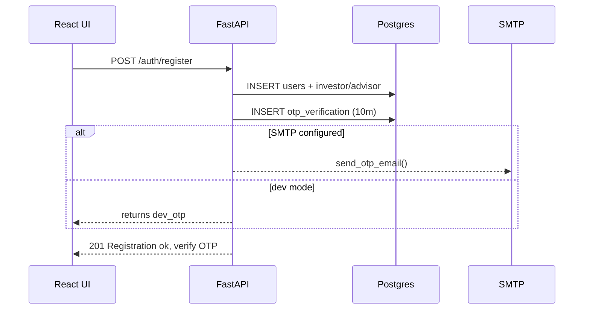
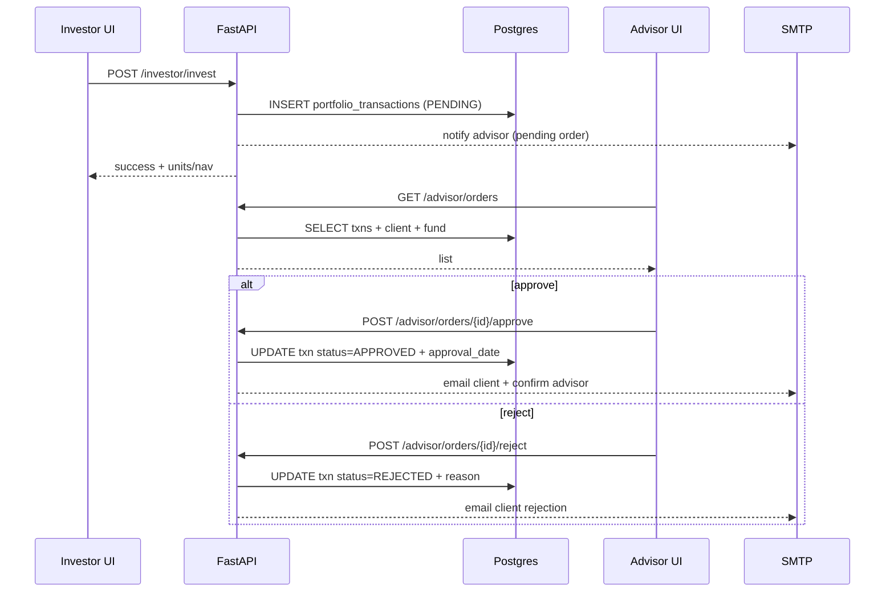
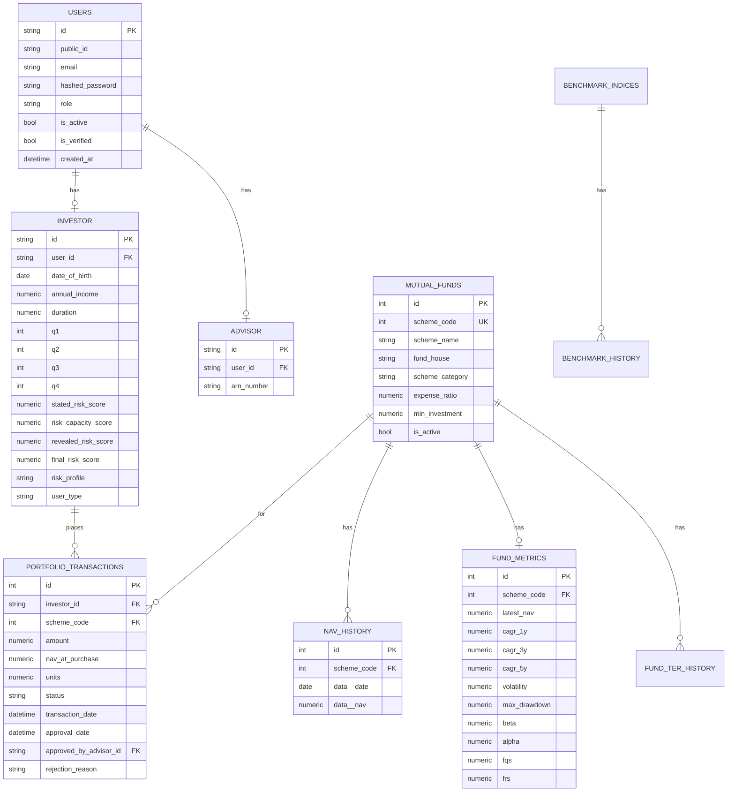

# Mutual Fund Purchase Optimizer (MFPO) — Low Level Design (LLD)

**Date**: 2026-03-09  
**Scope**: `Frontend/MF_Purchase_Optimizer_FE` + `Backend/MF_Purchase_Optimizer_BE` + Docker/Nginx edge

---

## 1. Purpose

This document describes the low-level design of MFPO: a role-based Mutual Fund recommendation and purchase workflow system with an Investor UI, Advisor approval workflow, and Admin management + ingestion.

---

## 2. System Overview

### 2.1 Technology Stack

| Layer | Module | Technology |
|---|---|---|
| UI | Frontend SPA | React 18 + Vite + Tailwind |
| Edge | Static + reverse proxy | Nginx (serves `dist/`, proxies `/api/`) |
| API | Backend | FastAPI (Python) |
| Data | Primary DB | PostgreSQL (SQLAlchemy ORM + Alembic migrations) |
| Scheduling | Background tasks | APScheduler (daily ingestion + metrics compute) |
| External | MF data | `mfapi.in` (fund metadata + NAV history) |
| External | Email | Gmail SMTP (or dev-mode fallbacks) |

### 2.2 Deployment Topology (Docker Compose)

- **Frontend container**: Nginx listens on **3000** (published as `3001:3000`)
- **Backend container**: FastAPI listens on **8000** (published as `8000:8000`)
- **Reverse proxy contract**:
  - Browser calls: `GET/POST /api/...`
  - Nginx proxies: `/api/` → `http://backend:8000/`

```mermaid
flowchart LR
  U[Browser] -->|HTTP(S) :3001| N[Nginx + React dist]
  N -->|/api/* proxy| B[FastAPI :8000]
  B -->|SQLAlchemy| P[(PostgreSQL)]
  B -->|SMTP| M[Email Provider]
  B -->|REST| X[mfapi.in]
```

---

## 3. Frontend (React SPA) — Low Level Design

### 3.1 Structure

**Entry points**
- `src/main.jsx`: React bootstrap
- `src/App.jsx`: Router + providers + route guards

**State / Cross-cutting**
- `src/context/AuthContext.jsx`: login/register/logout + session bootstrap from `localStorage`
- `src/context/ToastContext.jsx`: toasts
- `src/services/api.js`: Axios client with auth header + refresh-on-401 behavior

**Routing**

| Route | Component | Auth |
|---|---|---|
| `/` | `Home.jsx` | Public |
| `/signup` | `Signup.jsx` | Public |
| `/verify-otp` | `VerifyOTP.jsx` | Public (needs email query param) |
| `/signin` | `Signin.jsx` | Public |
| `/login-otp` | `LoginOTP.jsx` | Public (2nd factor) |
| `/forgot-password` | `ForgotPassword.jsx` | Public |
| `/reset-password` | `ResetPassword.jsx` | Public (token query param) |
| `/client-dashboard` | `ClientDashboard.jsx` | Investor |
| `/advisor-dashboard` | `AdvisorDashboard.jsx` | Advisor |
| `/admin-dashboard` | `AdminDashboard.jsx` | Admin |

**Route protection**
- `ProtectedRoute` validates `user` presence and optional `allowedRoles`.
- User role is derived from backend login response and stored in `localStorage`.

### 3.2 Auth Token Handling

**Storage**
- `access_token`, `refresh_token`: `localStorage`
- `user`: `{ email, role, public_id }` in `localStorage`

**Request interceptor**
- Adds `Authorization: Bearer <access_token>` for every request.

**401 response interceptor**
- Tries refresh: `POST /api/auth/refresh` with `{ refresh_token }`
- On success: rotates tokens in storage and retries original request
- On refresh failure: clears storage and redirects to `/signin`

### 3.3 Investor Dashboard (Key UI Flows)

**Data dependencies**
- Fund catalog: `GET /funds/`
- Fund NAV chart: `GET /funds/{scheme_code}/nav?limit=1500`
- Investor profile: `GET /investor/profile`, update via `PUT /investor/profile`
- Portfolio: `GET /investor/portfolio`
- Pending orders: `GET /investor/pending-orders`
- Investment history: `GET /investor/history`

**Recommendation + Invest**
- Recommendations: `POST /recommendations/` with amount, duration, optional risk override
- Invest single: `POST /investor/invest`
- Invest all: `POST /investor/invest-all`

### 3.4 Advisor Dashboard (Key UI Flows)

- Orders inbox: `GET /advisor/orders`
- Approve: `POST /advisor/orders/{transaction_id}/approve`
- Reject: `POST /advisor/orders/{transaction_id}/reject`
- View client profile: `GET /advisor/clients/{client_id}/profile`
- View client portfolio: `GET /advisor/clients/{client_id}/portfolio`

### 3.5 Admin Dashboard (Key UI Flows)

- Stats: `GET /admin/stats`
- Users list: `GET /admin/users`
- Fund list: `GET /admin/funds`
- Add fund: `POST /admin/funds` (scheme code metadata fetched from `mfapi.in`)
- Update fund: `PUT /admin/funds/{scheme_code}`
- Deactivate: `DELETE /admin/funds/{scheme_code}`
- Trigger ingestion: `POST /admin/ingest/nav`, `POST /admin/ingest/metrics`
- Oversight: `GET /admin/approved-orders`

---

## 4. Backend (FastAPI) — Low Level Design

### 4.1 Service Boundaries

Backend is a **FastAPI monolith** with routers under `src/api/v1/endpoints/`:

- `auth.py` (register/login/verify-login-otp/refresh/logout/me/change-password)
- `otp.py` (verify-otp/resend-otp)
- `password_reset.py` (forgot-password/reset-password)
- `funds.py` (fund list/details/nav history)
- `investor.py` (profile/risk, portfolio, invest, invest-all, pending, history)
- `recommendations.py` (allocation engine)
- `advisor.py` (client listing/context + order approvals)
- `admin.py` (stats/users/fund CRUD/ingestion triggers/approved-orders)

### 4.2 Cross-cutting Concerns

**Authentication**
- JWT access tokens + refresh tokens (`src/core/security.py`)
- `get_current_user` dependency validates Bearer JWT and loads `User` from DB (`src/core/dependencies.py`)
- Refresh token rotation is implemented via `token_blacklist` table.

**CORS**
- Allowed origins include local Vite dev hosts (`http://localhost:5173`, `http://127.0.0.1:5173`).

**Client-side encryption (optional)**
- Password fields may be client-encrypted using Fernet and decrypted server-side (`src/core/crypto.py`).
- If `ENCRYPTION_KEY` is missing, a fallback key is generated (dev).

**Scheduling**
- APScheduler runs daily at **01:00 server time** to ingest NAV data + recompute metrics (`src/core/scheduler.py`).

### 4.3 Authentication + OTP Flows (Detailed)

#### 4.3.1 Registration (Investor/Advisor)

Endpoint: `POST /auth/register`
- Validates role (`investor`/`advisor`)
- Advisor requires `arn` and ARN regex format
- Stores user + role-specific table (`investor` or `advisor`)
- Creates OTP row (`otp_verification`) valid for 10 minutes
- If SMTP configured: emails OTP, else returns `dev_otp`

Sequence:



#### 4.3.2 Verify Email OTP

Endpoint: `POST /auth/verify-otp` (router in `otp.py`)
- Finds latest unused OTP for email; checks expiry; marks `used=true`
- Sets `users.is_verified=true`

#### 4.3.3 Login with 2-step OTP

Step 1: `POST /auth/login`
- Validates password
- Enforces `is_verified`
- Creates a new OTP for login and returns `status=otp_required`
- OTP email is not automatically sent; user must call `POST /auth/resend-otp` from UI

Step 2: `POST /auth/verify-login-otp`
- Validates OTP, marks used
- Returns access + refresh JWT
- Sends login notification email asynchronously

#### 4.3.4 Refresh Token Rotation

Endpoint: `POST /auth/refresh`
- Rejects blacklisted refresh tokens
- Verifies token type=refresh and expiry
- Issues new access + new refresh token
- Blacklists old refresh token

#### 4.3.5 Logout

Endpoint: `POST /auth/logout`
- Validates refresh token and blacklists it

---

## 5. Core Business Logic

### 5.1 Risk Profiling

**Investor profile input**
- DOB, income, duration (years), questionnaire answers q1..q4

**Risk score generation**
- Implemented by `UserRiskScoreEngine` (`src/core/User_Risk_Score_Engine.py`)
- Wrapper logic in `RiskCalculatorService` (`src/services/risk_calculator.py`) chooses:
  - **New user**: no transactions → blend of stated risk + risk capacity
  - **Old user**: has transactions → includes revealed risk based on holdings + volatility tolerance + drawdown tolerance, plus history-based decay

**Where risk recalculates**
- On `PUT /investor/profile`: computes and stores stated/risk_capacity/revealed/final scores when inputs are complete
- On `GET /investor/profile`: attempts recalculation “live” if profile inputs exist
- After investing: `POST /investor/invest` triggers recalculation (best-effort)

### 5.2 Recommendation Engine

Endpoint: `POST /recommendations/`

**Inputs** (`RecommendationRequest`)
- `investment_amount`
- `duration_years`
- optional `risk_profile_override` (`Low`/`Moderate`/`High`)

**Fund universe**
- Join `mutual_funds` + `fund_metrics`
- Require `is_active=true`, `fqs!=null`, `frs!=null`

**Risk score used**
- If override present: map label to numeric score, blend with capacity (80/20)
- Else: use investor’s stored `final_risk_score`

**Compatibility filter**
- Excludes funds whose \(|FRS - filterScore| > 0.30\) (fallback to full universe if <2 remain)

**Scoring formula**

\[
FinalScore = (W_{FQS} \cdot FQS) - (W_{RM} \cdot |FRS - UserRisk|) + (W_{DF} \cdot DurationFit)
\]

Where:
- \(W_{FQS}=0.5\), \(W_{RM}=0.3\), \(W_{DF}=0.2\)
- `DurationFit = max(0, 1 - |ideal_duration - user_duration| / ideal_duration)`

**Allocation**
- Basket size expands with amount (4–8+) and uses “waterfall” allocation with:
  - **Per-fund concentration cap**: 25% of total amount
  - **Absolute cap**: ₹10 Cr per fund (code constant)
  - **Minimum investment** respected when starting a new fund position

**Expected return**
- Uses CAGR bucket based on duration (1Y/3Y/5Y) and computes:

\[
FV = Allocation \times (1 + CAGR)^{duration\_years}
\]

### 5.3 Order Workflow (Investor → Advisor → Investor)

**Investor places order**
- `POST /investor/invest` creates `portfolio_transactions` row with `status=PENDING`
- Advisor email notification (dev mode prints)

**Advisor action**
- Approve: status set to `APPROVED`, units already computed on placement
- Reject: status `REJECTED`, capture `rejection_reason`
- Emails are sent to the client on approve/reject (or printed in dev mode)



---

## 6. Data Design (Database Schema)

### 6.1 Entity Summary

**Identity**
- `users`: base account identity + role (`investor|advisor|admin`)
- `investor`: investor-specific profile + risk questionnaire + derived scores
- `advisor`: advisor-specific profile (ARN)

**Fund catalog + analytics**
- `mutual_funds`: metadata from `mfapi.in` + admin-managed fields
- `nav_history`: daily NAV time-series per fund
- `fund_metrics`: computed analytics and scoring (FQS/FRS)
- `fund_ter_history`: TER time-series (direct plan TER)

**Orders/portfolio**
- `portfolio_transactions`: investor orders and approval workflow

**Auth supporting tables**
- `otp_verification`: OTPs for email verification + login OTP
- `password_reset`: password reset tokens
- `token_blacklist`: refresh tokens revoked/rotated

**Benchmarks**
- `benchmark_indices`: benchmark master list
- `benchmark_history`: daily TRI values

### 6.2 ER Diagram (Logical)



---

## 7. API Design (Implemented Endpoints)

Base URL in production via Nginx: `/api/*` → backend `/`

### 7.1 Auth + OTP

| Endpoint | Method | Purpose |
|---|---:|---|
| `/auth/register` | POST | Register investor/advisor and create OTP |
| `/auth/register-admin` | POST | Create admin using `ADMIN_SECRET` |
| `/auth/verify-otp` | POST | Verify email OTP (registration) |
| `/auth/resend-otp` | POST | Resend OTP (registration or login OTP) |
| `/auth/login` | POST | Password check, creates login OTP |
| `/auth/verify-login-otp` | POST | Verify login OTP, issues JWT tokens |
| `/auth/refresh` | POST | Rotate refresh token and issue new access |
| `/auth/logout` | POST | Blacklist refresh token |
| `/auth/me` | GET | Get current user basics |
| `/auth/change-password` | POST | Rotate password |

### 7.2 Funds

| Endpoint | Method | Purpose |
|---|---:|---|
| `/funds/` | GET | List active funds + metrics summary |
| `/funds/{scheme_code}` | GET | Fund detail |
| `/funds/{scheme_code}/nav` | GET | NAV history for charting |

### 7.3 Investor

| Endpoint | Method | Purpose |
|---|---:|---|
| `/investor/profile` | GET | Investor profile + derived risk scores |
| `/investor/profile` | PUT | Update profile + (re)compute risk |
| `/investor/invest` | POST | Create pending order for a fund |
| `/investor/invest-all` | POST | Bulk create pending orders |
| `/investor/portfolio` | GET | Approved holdings aggregated by fund |
| `/investor/pending-orders` | GET | Pending orders list |
| `/investor/history` | GET | Full transaction history |

### 7.4 Recommendations

| Endpoint | Method | Purpose |
|---|---:|---|
| `/recommendations/` | POST | Generate allocations + explanation |

### 7.5 Advisor

| Endpoint | Method | Purpose |
|---|---:|---|
| `/advisor/clients` | GET | List all investor users + risk summary |
| `/advisor/clients/{client_id}/profile` | GET | Client profile details |
| `/advisor/clients/{client_id}/portfolio` | GET | Client portfolio |
| `/advisor/clients/{client_id}/recommendations` | GET | Generate recos for a client |
| `/advisor/orders` | GET | List all orders (pending first) |
| `/advisor/orders/{id}/approve` | POST | Approve pending order |
| `/advisor/orders/{id}/reject` | POST | Reject pending order |

### 7.6 Admin

| Endpoint | Method | Purpose |
|---|---:|---|
| `/admin/stats` | GET | System stats |
| `/admin/users` | GET | Users list |
| `/admin/funds` | GET | Fund list (including inactive) |
| `/admin/funds` | POST | Add fund (fetches mfapi metadata) |
| `/admin/funds/{scheme_code}` | PUT | Update fund editable fields |
| `/admin/funds/{scheme_code}` | DELETE | Deactivate fund |
| `/admin/ingest/nav` | POST | Trigger NAV ingestion script |
| `/admin/ingest/metrics` | POST | Trigger metrics computation script |
| `/admin/approved-orders` | GET | Approved orders oversight |

---

## 8. Background Jobs & Ingestion

### 8.1 Daily schedule

Job: `daily_nav_update` (01:00 AM)
- Runs NAV ingestion script
- Runs metrics computation script

### 8.2 Manual triggers (admin)

- `POST /admin/ingest/nav`: starts NAV ingestion in background task
- `POST /admin/ingest/metrics`: starts metrics computation in background task

---

## 9. Configuration (Environment Variables)

Loaded from backend `.env` via Pydantic settings (`src/core/config.py`):

- `DATABASE_URL`
- `SECRET_KEY`
- `ALGORITHM`
- `ACCESS_TOKEN_EXPIRE_MINUTES`
- `REFRESH_TOKEN_EXPIRE_DAYS` (default 7)
- `ADMIN_SECRET`
- `SMTP_EMAIL`, `SMTP_PASSWORD`
- `ENCRYPTION_KEY` (optional; Fernet key)
- `FRONTEND_URL` (default `http://localhost:5173`)

---

## 10. Non-functional Design Notes

### 10.1 Security

- **JWT**: access tokens for API calls; refresh rotation + blacklist
- **OTP**: expires in 10 minutes; stored in `otp_verification`
- **Password reset**: opaque random token, 30 minutes expiry
- **Email enumeration defense**: forgot password always returns success

### 10.2 Reliability / Consistency

- Orders are created as **PENDING** and require advisor action.
- Metrics / NAV ingestion is async (scheduler or admin trigger); UI should tolerate missing metrics (`None`) gracefully.

### 10.3 Observability

- Backend uses logger setup in some endpoints; extend with structured logging if required.
- Admin dashboard provides basic operational stats via `/admin/stats`.

---

## 11. References (In-repo)

- Block diagram: `LLD_BLOCK_DIAGRAM.md`
- Diagram HTML: `LLD_Diagram.html`
- Flow HTML: `LLD_Flows.html`
- Frontend README: `Frontend/MF_Purchase_Optimizer_FE/README.md`
- Backend README: `Backend/MF_Purchase_Optimizer_BE/README.md`

